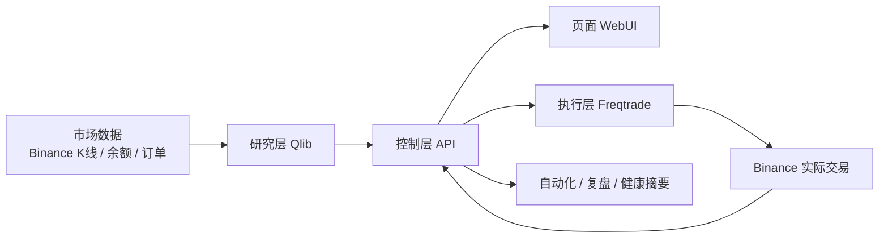
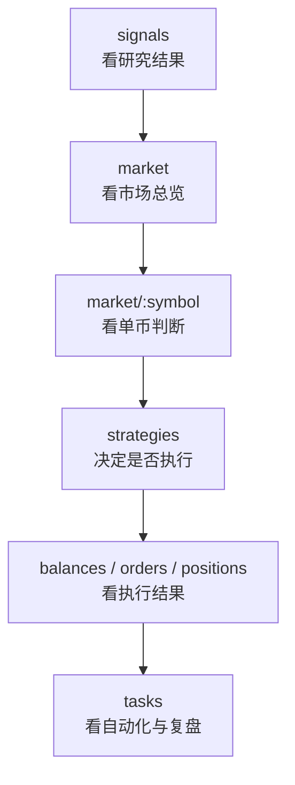
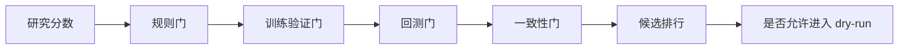
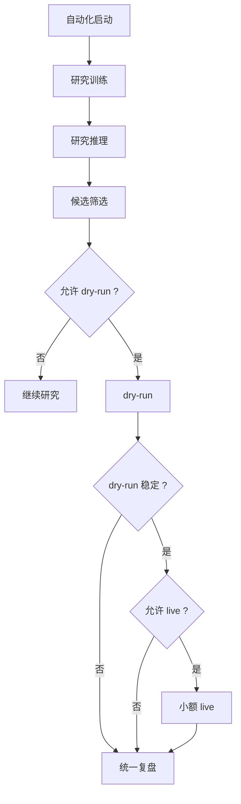
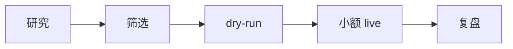

# Quant 系统导览

这份文档专门解释整个系统是怎么跑起来的。  
目标不是讲代码细节，而是让你快速回答这几个问题：

- 这个系统每一层在做什么
- 我点一个按钮之后，后面发生了什么
- 为什么有些流程会停在“继续研究”，有些会进入 `dry-run`，有些才会进入 `live`
- 自动化之后，系统是怎么自己跑一轮的

---

## 1. 整个系统在做什么

可以把现在的 `Quant` 理解成四层：

1. 研究层：`Qlib`
2. 执行层：`Freqtrade + Binance`
3. 控制层：`API + WebUI`
4. 自动化层：统一调度、健康摘要、复盘

它们之间的关系是：

一句话理解：

- `Qlib` 负责研究和判断
- `Freqtrade` 负责真正执行
- `API + WebUI` 负责把流程串起来并展示给你
- 自动化层负责定时跑、汇总结果、做复盘

---

## 2. 你平时体验项目时，完整流程是什么

当前最完整的一条人工体验链是：

对应页面含义是：

- `signals`
  - 看研究训练、研究推理、统一研究报告
  - 回答“现在哪个币更值得跟进”
- `market`
  - 看市场总览
  - 回答“应该先看哪个币”
- `market/:symbol`
  - 看图表、EMA、研究判断、下一步动作
  - 回答“这个币现在能不能做”
- `strategies`
  - 看推荐执行候选、执行器状态、是否允许进入 `dry-run`
  - 回答“要不要推进到执行”
- `balances / orders / positions`
  - 看账户、订单和持仓结果
  - 回答“执行之后发生了什么”
- `tasks`
  - 看自动化状态、健康摘要和复盘
  - 回答“这一轮整体怎么样”

---

## 3. 点击“运行 Qlib 信号流水线”之后，系统到底做了什么

这是目前最核心的一条研究流程。

### 第一步：准备研究运行环境

系统会先确认研究运行目录已经准备好。  
如果目录不存在，会自动创建，不需要你手动准备。

它的作用是：

- 保存训练结果
- 保存推理结果
- 保存数据快照
- 保存实验记录

你可以把它理解成“本轮研究的工作台”。

### 第二步：准备研究数据

系统会为这几个币准备研究样本：

- `BTCUSDT`
- `ETHUSDT`
- `SOLUSDT`
- `DOGEUSDT`

它会优先使用 `4h` K 线，因为你当前的目标持有周期是 `1-3 天`。  
如果 `4h` 不够，再回退到 `1h`。

然后系统会把历史样本切成三段：

- 训练集
- 验证集
- 测试集

目的很简单：

- 前面的样本用来“学习”
- 中间的样本用来“检查”
- 最后的样本用来“模拟未知未来”

这一步是为了避免“看过答案再回头做研究”。

### 第三步：生成因子和标签

系统不会直接拿 K 线原始数据做判断。  
它会先从 K 线里整理出一批最小因子，也就是研究特征。

当前重点看这些方向：

- 趋势
- 动量
- 波动
- 量能

比如会关注：

- 价格和均线的距离
- 波动是不是太大
- 成交量是不是在放大

与此同时，系统还会给每个历史样本补一个“结果标签”。  
标签回答的是：

- 如果当时做了这笔交易，未来 `1-3 天` 更像是：
  - `buy`
  - `sell`
  - `watch`

所以这一层本质上是在回答：

- 当时的市场样子是什么
- 后来事实证明它更像哪种结果

### 第四步：训练

训练不是让一个黑盒模型“神奇预测”，而是把前面这些历史样本总结成一份稳定的研究结果。

训练结束后，系统会产出：

- 模型版本
- 训练指标
- 验证结果
- 最小回测结果
- 数据快照

也就是说，训练完成后的核心问题不是“成功了没”，而是：

- 这次研究用了什么数据
- 结果好不好
- 值不值得继续往下走

### 第五步：推理

训练完成后，系统会马上做推理。

推理的含义是：

- 用刚才训练出来的规则和结果
- 去判断这 4 个币“现在这个时刻”的状态

每个币都会得到一组研究结果：

- 研究分数
- 方向倾向
- 研究解释
- 模型版本

这时候还没有进入交易。  
它只是告诉系统：

- 现在谁更像一个值得继续跟进的机会

### 第六步：过门

推理完成后，并不会直接交易。  
每个候选都会经过几层门：

这些门分别在做什么：

- 规则门
  - 趋势坏了没有
  - 波动是不是太大
  - 量能有没有确认
- 训练验证门
  - 样本够不够
  - 验证结果是不是太弱
- 回测门
  - 净收益是不是为正
  - 回撤是不是太大
  - Sharpe、胜率、连续亏损是不是太差
- 一致性门
  - 验证结果和回测结果有没有明显漂移

如果这些门没通过，系统会明确告诉你：

- 继续研究

如果通过了，系统才会说：

- 可以进入 `dry-run`

### 第七步：生成统一研究报告

最后系统会把这一轮结果整理成统一研究报告。

报告里现在会有：

- 当前最佳候选
- 候选排行榜
- 筛选通过率
- 被拦下的数量
- 失败原因汇总
- 最近实验摘要

所以你在 `signals` 页面里看到的，并不是“孤立的一条信号”，而是这一整轮研究流程的压缩结果。

---

## 4. `dry-run`、`live`、复盘分别是什么意思

### `dry-run`

`dry-run` 的意思是：

- 按真实执行逻辑走一遍
- 但不真的花你的钱

它会模拟：

- 下单
- 订单状态变化
- 持仓变化
- 盈亏变化

但不会在 Binance 上真正成交。

### `live`

`live` 才是真实交易。

也就是：

- 真正去 Binance 下单
- 真正买入或卖出
- 真正影响你的账户余额和持仓

所以现在系统会非常谨慎，不会让研究结果直接跳过 `dry-run` 去 `live`。

### 复盘

复盘的作用是把这一轮动作讲清楚。

复盘会回答：

- 这轮训练有没有完成
- 推理有没有完成
- 候选有没有通过筛选
- 有没有进入 `dry-run`
- 有没有进入 `live`
- 这一轮最后应该继续、暂停还是回到研究

一句话理解：

- `dry-run` 是演练
- `live` 是真实下单
- 复盘是给这一轮结论

---

## 5. 自动化之后，系统是怎么自己跑一轮的

自动化主链现在已经具备最小可用版本。

它的一轮自动化流程大致是：

当前自动化不会无脑直接开仓。  
它仍然受这些硬限制：

- 自动化模式开关
- 是否暂停
- 是否允许 `live`
- 白名单
- 单笔金额上限
- 最大持仓数
- 研究筛选是否通过
- 执行器是否健康

所以自动化的本质不是“放飞自我自动下单”，而是：

- 让系统自己按规则跑一轮
- 但关键安全边界仍然保留

---

## 6. 为什么有时候流程会停住

如果你看到系统停在某一步，常见原因通常是下面几类。

### 1. 停在研究阶段

说明：

- 数据样本不够
- 研究结果太弱
- 训练和回测不一致

这时页面通常会告诉你：

- 继续研究

### 2. 停在 `dry-run` 前

说明：

- 候选没有通过筛选门
- 或者没有通过 `dry-run` 准入门

这不是系统坏了，而是系统在说：

- 这个候选还不值得进入执行验证

### 3. 停在 `live` 前

说明：

- `dry-run` 结果还不够稳定
- 或者 `live` 安全门没放行
- 或者真实执行环境不健康

这是为了避免研究结果一出来就直接动真钱。

### 4. 停在执行后

说明：

- 可能是复盘还没完成
- 也可能是账户里存在交易所零头

例如 `DOGE` 这类资产，有时会因为交易所最小步长留下小尾数。  
这时余额页会把它标成“交易所零头”，而不是正常打开中的仓位。

---

## 7. 现在系统最重要的主线是什么

当前项目最核心的主线已经不是“把页面做出来”，而是：

也就是：

1. 先做研究
2. 再做筛选
3. 再做 `dry-run`
4. 再做小额 `live`
5. 最后做复盘

这条线的目标不是一次就找到神策略，而是：

- 能稳定重复
- 能解释为什么进
- 能解释为什么不过
- 能解释为什么执行
- 能解释这一轮最后结果如何

---

## 8. 你现在最适合怎样理解这个系统

最简单的理解方式是：

- `signals` 看研究
- `market` 看标的
- `market/:symbol` 看单币判断
- `strategies` 看是否执行
- `balances / orders / positions` 看结果
- `tasks` 看自动化和复盘

如果你只记一句话，就记这个：

> `Quant` 现在做的事情，是把“研究判断”一步步收紧成“可验证、可执行、可复盘”的个人量化流程，而不是直接拿一个模型去盲目下单。

