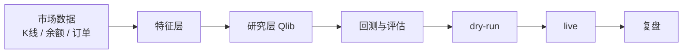
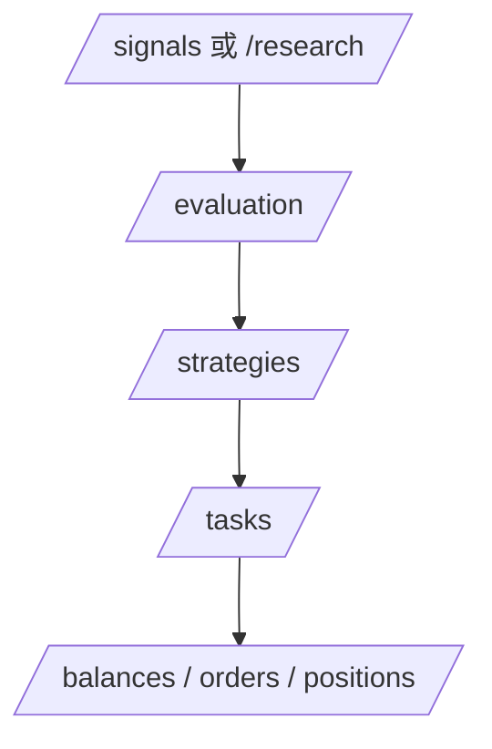
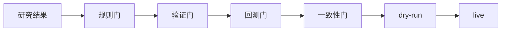

# Quant 系统导览

这份文档专门解释整套系统是怎么跑的。  
它不讲实现细节，重点回答：

- 系统每一层在做什么
- 页面之间怎么走
- 点击一个按钮后，后面发生了什么
- 为什么有的候选会停在研究，有的能进 `dry-run`，更少数才会进入 `live`

## 1. 系统总流程

当前主链固定成：

一句话理解：

- 数据层负责准备样本
- 特征层负责把原始数据变成研究因子
- 研究层负责训练、推理、筛选
- 回测和评估负责告诉你值不值得继续
- 执行层负责真正下到 `dry-run / live`
- 复盘负责告诉你这轮到底好不好

## 2. 页面使用流程

当前推荐使用路径：

对应含义：

- `/signals` 或 `/research`
  - 发起训练和推理
  - 看研究运行状态
- `/evaluation`
  - 看推荐原因
  - 看淘汰原因
  - 看实验对比
- `/strategies`
  - 看当前推荐候选
  - 看它是否能进入 `dry-run / live`
- `/tasks`
  - 看自动化
  - 看告警
  - 看人工接管
- `/balances`、`/orders`、`/positions`
  - 看执行结果

## 3. 点击“运行 Qlib 信号流水线”之后会发生什么

这是现在最核心的研究入口。

### 第一步：准备运行环境

系统会先准备研究运行目录和最新配置。  
如果缺运行目录，会自动补齐。

### 第二步：准备数据

系统会根据当前工作台配置，决定：

- 研究标的
- 主标的
- 时间周期
- 时间范围
- 持有窗口

然后生成一份统一数据快照。

### 第三步：生成特征和标签

系统会按当前配置，把样本转成研究输入：

- 趋势因子
- 动量因子
- 震荡因子
- 成交量因子
- 波动率因子

同时生成当前标签方式对应的结果标签。

### 第四步：训练

训练结束后，系统会产出：

- 模型版本
- 数据快照
- 训练摘要
- 验证摘要
- 最小回测摘要

### 第五步：推理

推理会对候选池里的币做当前时刻判断，输出：

- 分数
- 推荐动作
- 推荐原因
- 候选排行

### 第六步：过门

候选不会直接进入执行，而是先过几层门：

这里回答的问题是：

- 这个候选值不值得进 `dry-run`
- 它是否已经稳到能继续进 `live`

### 第七步：写回页面和任务中心

最后会更新：

- 研究运行状态
- 统一研究报告
- 评估页实验对比
- 任务页最近工作流来源

所以你现在点按钮后，不需要再猜系统是不是在跑。

## 4. 为什么有时会“继续研究”

现在系统不会只凭分数高就往下推。

常见停在研究层的原因有：

- 规则门没过
- 验证结果不稳
- 回测净收益不够
- 研究结果和执行结果差异太大
- 当前只适合先停在 `dry-run`

页面上你主要在这些地方看：

- `/evaluation`
- `/tasks`
- `/strategies`

## 5. 为什么研究推荐和执行池不是完全一样

当前系统采用的是：

- 研究和 `dry-run` 使用统一候选池
- `live` 继续使用更严格的小子集

这样做的目的不是拆断链路，而是：

- 推荐出来的币，至少能继续进入 `dry-run`
- 真正进入 `live` 的，还要再过更严的限制

## 6. 当前推荐的人工使用路径

### 研究验证路径

1. 运行研究训练
2. 运行研究推理
3. 到评估页看推荐和淘汰原因
4. 进入策略页确认是否允许 `dry-run`
5. 到任务页看自动化和接管状态
6. 到订单、持仓、余额页看结果

### 自动化观察路径

1. 先看任务页当前模式
2. 看最近工作流来源
3. 看活跃告警
4. 看人工接管时间线
5. 再决定恢复、暂停还是手动接管

## 7. 当前最重要的几个页面分别回答什么

### `/data`

回答：

- 这次研究到底用了什么数据

### `/features`

回答：

- 当前用了哪些因子
- 每类因子的权重是什么

### `/research`

回答：

- 这次研究到底在研究什么
- 当前模型、标签、持有窗口是什么

### `/backtest`

回答：

- 回测为什么长成这样
- 成本影响有多大

### `/evaluation`

回答：

- 为什么推荐
- 为什么淘汰
- 哪两轮实验差在哪里

### `/strategies`

回答：

- 当前最值得推进哪个币
- 它能不能进 `dry-run / live`

### `/tasks`

回答：

- 系统现在是不是稳定
- 该继续跑、该暂停、还是该人工接管

## 8. 给新 AI 的最短理解方式

如果是新会话接手，先按这个顺序读：

1. `CONTEXT.md`
2. `README.md`
3. `docs/roadmap.md`
4. `docs/architecture.md`
5. 这份 `docs/system-flow-guide.md`

然后再决定要不要继续深读：

- `docs/developer-handbook.md`
- `docs/deployment-handbook.md`
- `docs/ops-freqtrade.md`
- `docs/ops-qlib.md`
